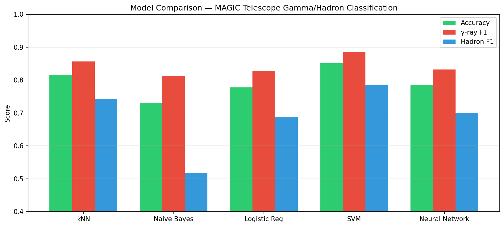
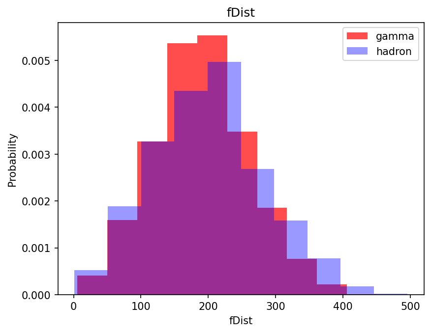
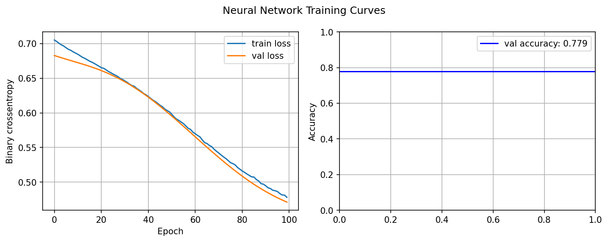

# Gamma-Ray Classification from MAGIC Telescope Data

Supervised machine learning pipeline for distinguishing **gamma-ray signals** 
from **hadronic background** using data from the MAGIC (Major Atmospheric 
Gamma Imaging Cherenkov) telescope — a ground-based instrument detecting 
Very High Energy cosmic gamma rays at TeV energies.



## Physics Background

The MAGIC telescope detects Cherenkov radiation — faint blue light emitted 
when high-energy particles travel through the atmosphere faster than the local 
speed of light. When a gamma ray or cosmic ray enters the atmosphere, it 
triggers a cascade of secondary particles (an air shower). The telescope 
images this shower and records its shape parameters.

The core challenge is **signal vs. background discrimination**: genuine 
gamma-ray showers must be separated from the far more numerous hadronic 
showers initiated by cosmic rays (protons, nuclei). This is the same class 
of classification problem faced at collider experiments like ATLAS and CMS 
at the LHC.

Each event is described by **Hillas parameters** — geometric properties of 
the elliptical shower image in the camera plane:

| Feature | Description |
|---|---|
| fLength | Major axis of shower ellipse [mm] |
| fWidth | Minor axis of shower ellipse [mm] |
| fSize | Log of total pixel intensity |
| fConc | Concentration: ratio of two brightest pixels |
| fAsym | Asymmetry along major axis |
| fAlpha | Orientation angle of ellipse [deg] |
| fDist | Distance from image center to camera center [mm] |

## Dataset

UCI MAGIC Gamma Telescope dataset — 19,020 Monte Carlo simulated events,  
10 Hillas parameters, binary labels (gamma / hadron).  
Class distribution: 12,332 gamma (65%), 6,688 hadron (35%).  
RandomOverSampler applied to training set to correct class imbalance.

**Source:** https://archive.ics.uci.edu/dataset/159/magic+gamma+telescope  
**Generated with:** CORSIKA Monte Carlo simulation code

## Methods and Results

Five classifiers trained and evaluated on identical 60/20/20 train/val/test splits:

| Model | Accuracy | γ-ray F1 | Hadron F1 |
|---|---|---|---|
| k-Nearest Neighbors (k=8) | 0.81 | 0.85 | 0.74 |
| Gaussian Naive Bayes | 0.73 | 0.81 | 0.51 |
| Logistic Regression | 0.79 | 0.83 | 0.71 |
| Support Vector Machine | **0.86** | **0.89** | **0.79** |
| Neural Network (PyTorch) | 0.79 | 0.84 | 0.71 |

## Key Findings

- **SVM achieves the best performance** (86% accuracy, gamma F1 = 0.89), 
  consistent with published results on this dataset
- **Naive Bayes performs worst** — the independence assumption between 
  Hillas parameters is violated; shower shape parameters are geometrically 
  correlated by construction
- **fAlpha is the most discriminating feature** visually — gamma showers 
  from a point source have small fAlpha (shower points toward source), 
  hadronic showers are isotropic
- Class rebalancing via oversampling improves gamma recall at slight cost 
  to hadron precision

## Feature Distributions



## Neural Network Training



## Reproduce

```bash
pip install ucimlrepo scikit-learn imbalanced-learn torch matplotlib pandas numpy
jupyter notebook notebooks/magic_telescope.ipynb
```

Data is fetched automatically via ucimlrepo — no manual download needed.

## Skills Demonstrated

Python · NumPy · pandas · scikit-learn · PyTorch · Matplotlib ·  
RandomOverSampler · StandardScaler · Signal/background discrimination ·  
Hillas parameterization · Monte Carlo simulation data